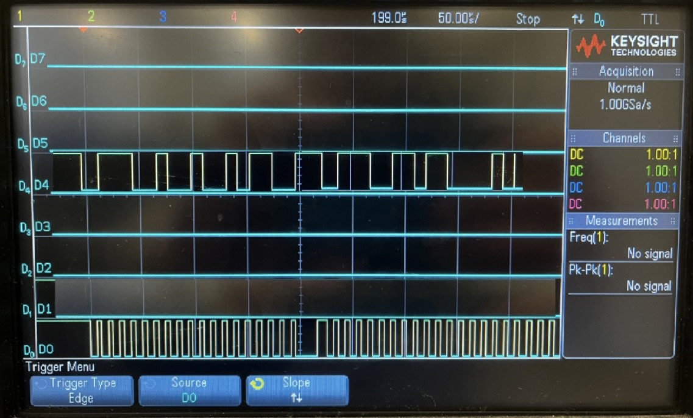

### TODO:

- use your Lab 1 firefly code to generate ADPS9960 I2C traffic and display it on a lab oscilloscope
- take a screenshot of some portion of this exchange, and figure out/annotate what's happening based on the protocol documentation in the ADPS9960 datasheet 

### Overview

This is a screenshot of the ADPS9960 I2C traffic on a oscilloscope while my firefly code is running.

## Screenshot of oscilloscope result

