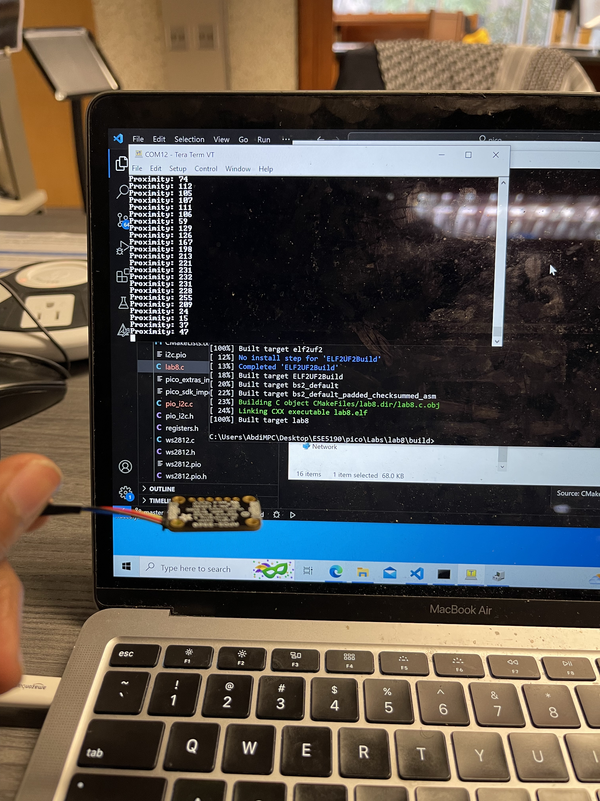

### TODO:

Use the capabilities of your sequencer to implement the ADPS9960 protocol and control the sensor.

## How it works

In this segment, the RGBC (Red, Green, Blue, and Clear light) and proximity data are acquired from the APDS9960 sensor through the PIO I2C interface. This information is then periodically displayed on the console for monitoring purposes.

Additionally, the performance of the proximity measurement feature of the APDS9960 was evaluated to ensure accurate and reliable detection of objects near the sensor.

