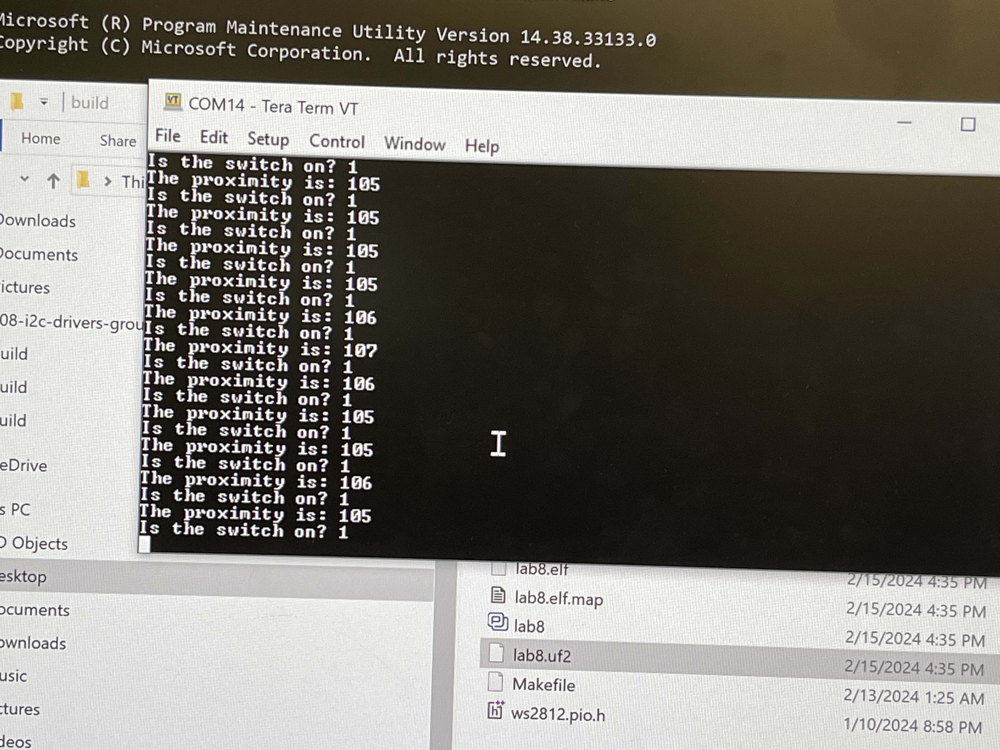

### TODO:

Add support for your custom circuit board to your sequencer, and give a demo.

## Components used for protoboard work

- RP2040
- APDS9960
- Red LED
- 1k Ohm resistor
- Switch
- Protoboard
- Wires

## Peripheral used

- GPIO
- I2C

## How the prototype works

This prototype functions as a straightforward lighting system. Upon activation, the APDS9960's proximity sensor is engaged to detect the presence of nearby objects, transmitting proximity data to the RP2040 via I2C communication. When the proximity measurement exceeds a threshold of 100, an onboard red LED is programmed to blink as an alert.

Users have the option to manually adjust the lighting according to their preferences by toggling the light switch.

### Demo GIF

